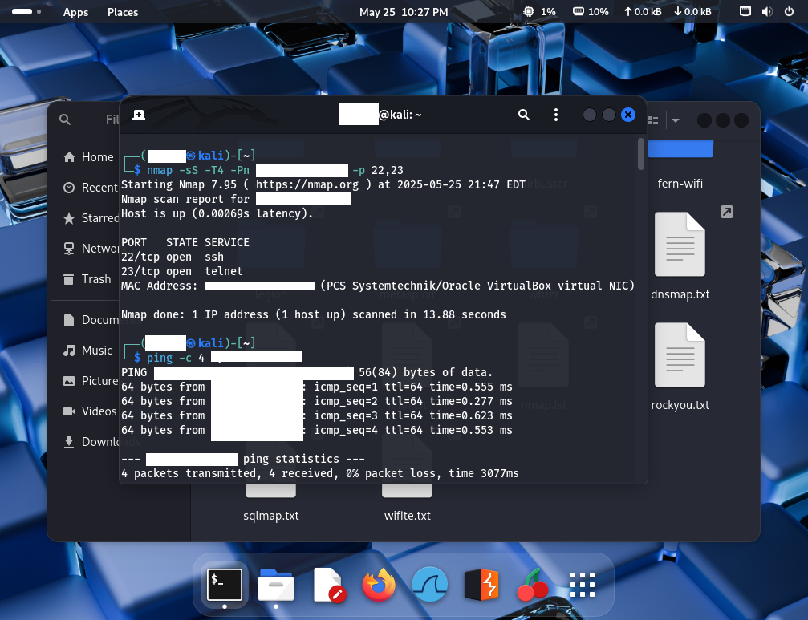
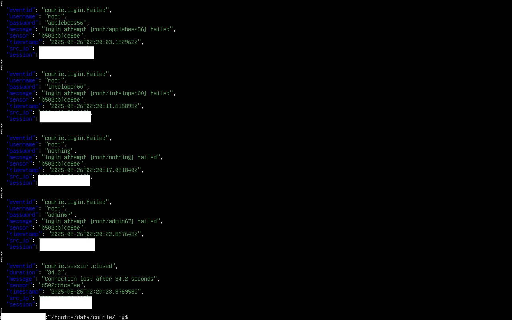
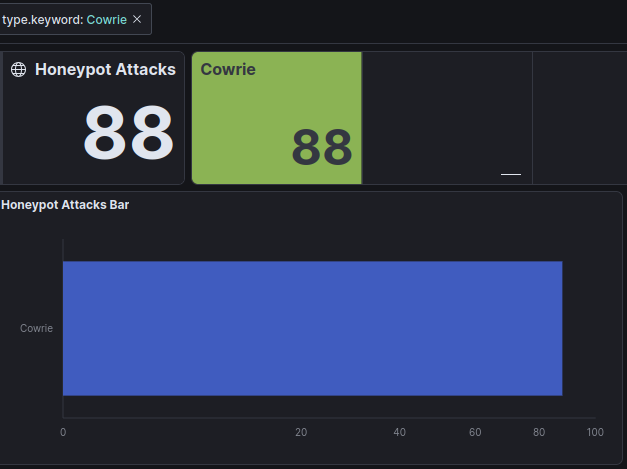

# Cowrie Honeypot Lab Report

**Lab Type:** Local VM-based  
**Platform:** T-Pot + Kali Linux  
**Network:** Host-Only (Isolated)  
**Analyst:** Michael W.  
**Date:** May 25th, 2025

---

## Overview

This lab simulates attacker interaction with a **Cowrie honeypot** service running inside a **T-Pot VM**.  
A second VM (**Kali Linux**) is used to scan, identify, and connect to fake services exposed by Cowrie.

**Goals:**
- Observe attacker behavior
- Confirm Cowrie’s logging capabilities

---

## Step 1: Environment Setup

- T-Pot installed and running with Docker containers.
- VM has two adapters:
  - **Adapter 1 (Bridged):** For T-Pot updates
  - **Adapter 2 (Host-Only):** For isolated communication with Kali
- Kali Linux used for simulated attacks
- T-Pot web UI verified accessible from the host (Linux Mint)

---

## Step 2: Network Discovery from Kali

- Ran `nmap` on the host-only network
- Discovered Cowrie exposing common ports (e.g., `22`, `23`)
- Noted services were fake and designed to lure attackers



---

## Step 3: Simulated Attacker Interaction

- Attempted SSH access to Cowrie's fake SSH service
- Confirmed connection message and fake shell prompt
- Session timed out
- Repeated login attempts with common credentials to simulate brute-force
- Observed successful "logins" into a fake shell session


---

## Step 4: Log Verification

- Verified Cowrie logs located at:
  ```
  /data/cowrie/log/cowrie.json
  ```
- Installed `jq` on the T-Pot host to parse logs:
  ```bash
  jq 'select(.eventid == "cowrie.login.failed" or .eventid == "cowrie.command.input")' /data/cowrie/log/cowrie.json
  ```
- Viewed login attempts and command inputs



---

## Step 5: Extra screenshots




---

## Conclusion

This lab successfully demonstrated:

- Deployment of T-Pot in a safe, isolated environment
- Effectiveness of Cowrie as a honeypot
- Simulation of attacker behavior
- Use of `jq` to extract and format forensic data from logs
